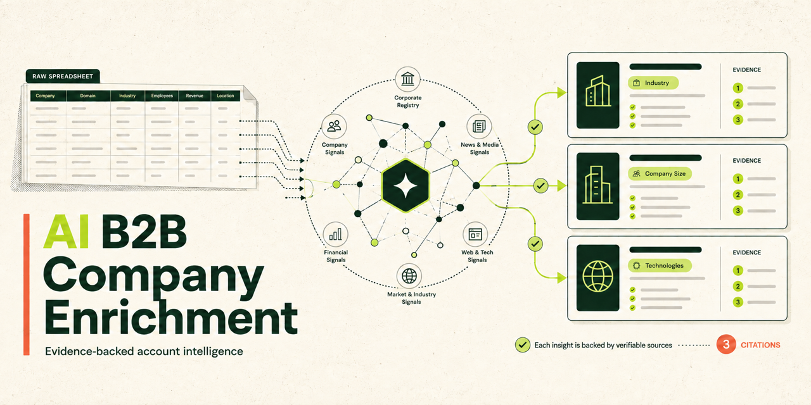

# AI B2B Company Enrichment

[](https://github.com/1aday/ai-b2b-company-enrichment/actions/workflows/ci.yml)


[](LICENSE)

Turn a CSV of company accounts into structured, evidence-backed B2B intelligence. The pipeline collects first-party website evidence, builds auditable Markdown packets, runs a strict enrichment schema, optionally qualifies each account against an ICP, and preserves the evidence behind every material claim.

The default product is general company enrichment. The original capital-source qualification workflow remains available as a preset instead of being discarded.

> **Public demo:** the dashboard is a static sample workspace built from fictional companies. It has no API routes, accepts no keys, cannot start paid model calls, and exposes no local run paths. The verified Vercel preview URL will be added after the deployment scope is selected.

## What comes out

Each company record contains:

- identity and canonical website details;
- firmographics with explicit unknowns;
- products, services, target customers, and value proposition;
- conservative commercial, hiring, technology, and event signals;
- optional ICP qualification with matched criteria, gaps, and disqualifiers;
- cautious account-level outreach context;
- field-level source evidence and confidence;
- quality, coverage, missing-field, and review flags.

If no ICP is supplied, the contract requires:

```json
{
  "qualification": {
    "status": "not_scored",
    "icp_score": null,
    "rationale": "No ICP was supplied, so the company was not scored."
  }
}
```

No score is fabricated.

## Try it free

Requirements: Node.js 22 or newer.

```bash
npm ci
npm run fixture
```

That command runs a deterministic prepared packet through the complete company schema and writes a validated CSV and JSON record. It makes no network request and costs `$0`.

Try the same packet with an explicit ICP:

```bash
npm run fixture:icp
```

Confirm the preserved capital-source contract:

```bash
npm run fixture:capital-source
```

Launch the static sample dashboard:

```bash
cd ui
npm ci
npm run dev
```

Open `http://localhost:3210`.

## Input

Only four CSV columns are required:

```csv
source_record_id,company_name,domain,website_url
acct-001,Northstar Cloud,northstarcloud.example,https://northstarcloud.example
```

Additional columns are preserved under `source_context` and copied into the flattened output with a `source_` prefix. They are context, not assumed truth.

This is an account-level system. It does not discover people, personal email addresses, or other personal contact data.

## Run real enrichment

Create `.env.local`:

```bash
OPENROUTER_API_KEY=your_key_here
```

Run the default company preset:

```bash
npm run flow -- \
  --input=/absolute/path/to/companies.csv \
  --provider=openrouter \
  --model=openai/gpt-4.1-mini \
  --limit=20
```

Add ICP scoring:

```bash
npm run flow -- \
  --input=/absolute/path/to/companies.csv \
  --provider=openrouter \
  --icp=/absolute/path/to/icp.json \
  --limit=20
```

Run the original capital-source workflow:

```bash
npm run flow:capital-source -- \
  --input=/absolute/path/to/companies.csv \
  --provider=openrouter \
  --limit=20
```

Use `--dry-run=true` to inspect the planned commands without scraping or calling a model.

## Preset contract

Every preset supplies the same six kinds of behavior:

| Interface | Company preset | Capital-source preset |
| --- | --- | --- |
| Schema | General B2B company record | Original allocator record |
| Prompt | Account intelligence | VC capital-source qualification |
| Validation | Evidence + ICP invariants | Preserved verification/profile contract |
| Keyword filter | Disabled by default | Allocator gate enabled |
| CSV mapping | Company and qualification fields | Original flattened capital fields |
| Benchmarks | Identity, offering, signals, evidence | Allocator status and capital appetite |

The active definitions live in [`src/presets/`](src/presets/).

## Architecture

```text
company CSV
    │
    ▼
website scraper ──► raw Markdown + source metadata
    │
    ▼
packet builder ───► ranked first-party evidence packet
    │
    ▼
preset ───────────► schema + prompt + validation + CSV mapping
    │
    ├── fixture provider ─────► deterministic, free validation
    └── OpenRouter provider ──► real model enrichment + retry
                                │
                                ▼
                 JSON + CSV + raw response + cost summary
```

Stages are deliberately durable. A failed model response can be inspected or retried without paying to scrape the company again.

See [architecture](docs/architecture.md), [output contract](docs/output-contract.md), and [operations](docs/operations.md) for the detailed design.

## Output layout

```text
runs/<run-id>/
  flow-manifest.json
  scrape_company_websites.log
  prepare_evidence_packets.log
  enrich_accounts.log
  scrape-runs/<run-id>-scrape/
    markdown/<company>/*.md
    markdown/<company>/_company_index.json
    prepared_for_llm/<company>/llm_input.md
    prepared_for_llm/<company>/llm_input.json
  enrichment/
    config.json
    enriched.csv
    enriched-index.json
    enriched_json/<company>.json
    responses/<model>/<company>.json
    summary.json
```

Old generated run artifacts keep their original paths and are not migrated or rewritten.

## Validation evidence

Validated on 2026-09-04 from a clean feature branch:

| Check | Result |
| --- | --- |
| Root strict TypeScript | Passed |
| Automated contract tests | 9 passed, 0 failed |
| Company fixture without ICP | Passed; `not_scored`, `null`, `$0` |
| Company fixture with ICP | Passed; explicit scored fixture, `$0` |
| Capital-source fixture | Passed through preserved preset, `$0` |
| Company and capital-source dry runs | Passed |
| Generic benchmark preparation | Passed offline |
| Next.js production build | Passed; static `/` route |
| UI dependency audit | 0 known vulnerabilities after upgrading to Next.js 16.3.4 |
| Repository hero | Verified PNG, 1280×640 |

The tests cover missing websites, empty scrapes, malformed JSON, provider retry classification, evidence requirements, ICP/no-ICP invariants, and preservation of extra CSV context.

Run the same checks:

```bash
npm run typecheck
npm test
npm run fixture
npm run fixture:icp
npm run fixture:capital-source
npm run flow -- --input=examples/input.sample.csv --dry-run=true --limit=2
npm run ui:build
```

## Cost model

- Scraping, packet preparation, validation, and the fixture provider do not consume model tokens.
- OpenRouter cost is calculated from prompt/completion usage and the configured per-token rates.
- Empty packets are stopped before model execution.
- Raw responses are retained so parser failures can be diagnosed without hiding provider behavior.
- Paid-model benchmark cells remain unclaimed until a real key-backed run produces evidence.

## Limitations

- JavaScript-heavy, blocked, parked, or incorrect websites can produce empty evidence packets.
- Company size and revenue are left blank when first-party evidence is insufficient.
- Commercial signals are evidence summaries, not proof of buying intent.
- ICP scores depend on the quality and specificity of the supplied ICP.
- The scraper does not bypass authentication, CAPTCHAs, paywalls, or access controls.
- OpenRouter behavior, model availability, and prices can change; validate before scaling.

## Data safety

- Public fixtures use fictional `.example` companies.
- Secrets belong only in ignored `.env.local` files.
- The sample dashboard is static and cannot access local artifacts.
- The output schema is company/account-level and excludes personal contacts.
- Source URLs and raw provider responses are stored for audit, so production operators should apply their own retention policy.
- Never commit real customer lists or generated production runs.

## Repository map

- [`src/run-company-enrichment-flow.ts`](src/run-company-enrichment-flow.ts) — orchestration
- [`src/scrape-company-websites.ts`](src/scrape-company-websites.ts) — first-party collection
- [`src/prepare-company-llm-packets.ts`](src/prepare-company-llm-packets.ts) — evidence packet construction
- [`src/enrich-company-packets.ts`](src/enrich-company-packets.ts) — fixture/OpenRouter execution
- [`src/presets/`](src/presets/) — schema, prompt, filters, validation, mapping, benchmarks
- [`examples/fixtures/`](examples/fixtures/) — deterministic, fictional inputs and outputs
- [`ui/`](ui/) — static sample dashboard

## License

MIT. See [LICENSE](LICENSE).
